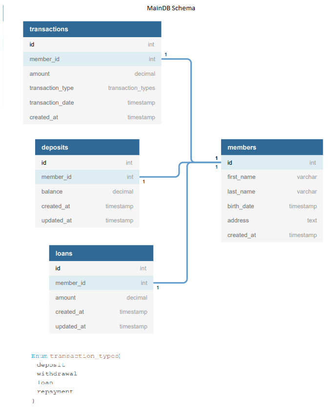
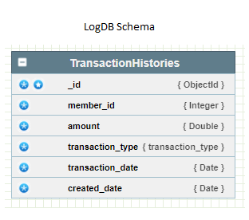

# Introduction

This repository contains about a deposit and loan management application in a village that nowhere. hehe.

# Tech Stack

I used these tech stack for create this project with:
* Java 8
* [Spring Boot](https://spring.io/projects/spring-boot)
* PostgreDB (as main data storage)
* MongoDB (as log data storage)
* [Kafka](https://kafka.apache.org/)
* Swagger 2

# Architecture

<div align='center'>


</div>

# DB Schema

<div align='center'>





</div>

# Api Documentation

This project already have an API Documentation that we create using Swagger 2. 

You can read that documentation on : http://localhost:8090/swagger-ui/

You also can test our API using Postman. You can download the postman file [here](https://github.com/rizkyjayusman/cooperation/blob/main/docs/cooperation.postman_collection.json)


# Implemented Features

This tables shows which features that has been implemented by this repository.

:white_check_mark: : ready

:heavy_exclamation_mark: : in progress

:x: : not yet implemented

| Features                          | Sub Features                    | Status                              |
| --------------------------------- | ------------------------------- | ----------------------------------- |
| Member                            | Get All Members                 | :white_check_mark:                  |
|                                   | Add New Member                  | :white_check_mark:                  |
| Transaction                       | Get All Transactions            | :white_check_mark:                  |
|                                   | Create New Transaction          | :white_check_mark:                  |
| Transaction History               | Get All Transaction Histories   | :white_check_mark:                  |
|                                   | Create Transaction History      | :white_check_mark:                  |
| Deposit                           | Get All Member's Deposit        | :white_check_mark:                  |
|                                   | Create New Deposit              | :white_check_mark:                  |
| Withdrawal                        | Create Withdrawal               | :white_check_mark:                  |
| Loan                              | Get All Member's Loan           | :white_check_mark:                  |
|                                   | Create New Loan                 | :white_check_mark:                  |
| Repayment                         | Create Loan Repayment           | :white_check_mark:                  |
| Unit Test                         |                                 | :heavy_exclamation_mark:            |
| Api Documentation with Swagger    |                                 | :white_check_mark:                  |


# Build and Run (Without Docker)

```
1. Clone the Project
   $ git clone git@github.com:rizkyjayusman/cooperation.git
   $ cd cooperation

2. Build and Package the Project
   $ mvn -e clean package

3. Run the Project
   $ java -jar /cooperation-project-path/app.jar
```

# Build and Run (With Docker)

```
1. Clone the Project
   $ git clone git@github.com:rizkyjayusman/cooperation.git
   $ cd cooperation

2. Build and Package the Project
   $ docker build -t alami-cooperation-app .
   $ docker-compose up -d --build
```
