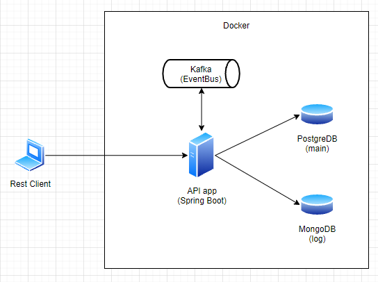

# Introduction

this repository is my take home project interview from some company in Jakarta

# Tech Stack

I used these tech stack for create this project with:
* Java 8
* [Spring Boot](https://spring.io/projects/spring-boot)
* PostgreDB
* MongoDB
* [Kafka](https://kafka.apache.org/)

# Architecture

<div align='center'>



</div>

g# Build and Run


```
1. Clone the Project
   $ git clone git@github.com:rizkyjayusman/cygnus.git
   $ cd cygnus

2. Build and Package the Project
   $ mvn -e clean package

3. Run the Project
   $ java -jar /cygnus-project-path/app.jar
```
